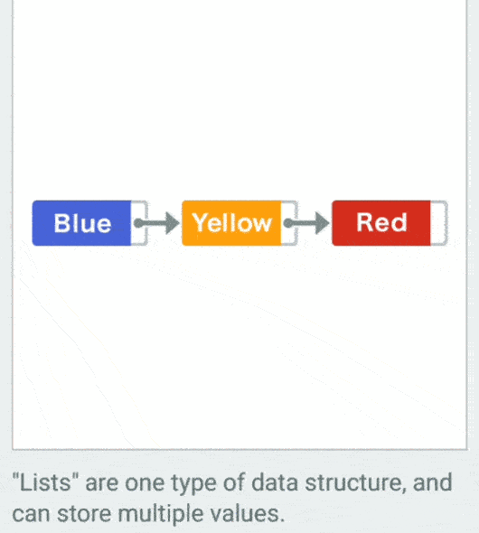

## What Big O notation?

Big O notation is a mathematical notation that describes the limiting behavior of a function when the argument tends towards a particular value or infinity. It is a member of a family of notations invented by Paul Bachmann, Edmund Landau, and others, collectively called Bachmann–Landau notation or asymptotic notation.

http://bigocheatsheet.com/

# Data Structure

## Linked List

A linked list is a linear data structure, in which the elements are not stored at contiguous memory locations. The elements in a linked list are linked using pointers as shown in the below image:

## Double Linked List

A Doubly Linked List (DLL) contains an extra pointer, typically called previous pointer, together with next pointer and data which are there in singly linked list.

## Arrays

An array can be defined as an ordered collection of items indexed by contiguous integers.

## Stacks

Stack is a linear data structure which follows a particular order in which the operations are performed. The order may be LIFO(Last In First Out) or FILO(First In Last Out).

## Queues

A Queue is a linear structure which follows a particular order in which the operations are performed. The order is First In First Out (FIFO). A good example of a queue is any queue of consumers for a resource where the consumer that came first is served first. The difference between stacks and queues is in removing. In a stack we remove the item the most recently added; in a queue, we remove the item the least recently added.

## Hash Tables

Hash Table is a data structure which stores data in an associative manner. In a hash table, data is stored in an array format, where each data value has its own unique index value. ... Thus, it becomes a data structure in which insertion and search operations are very fast irrespective of the size of the data.

## Heaps

## Binary Search Trees

## Bloom Filter

# List Search

## linear Search

## Binary Search

# Graph Search

## Breath-First-Search

## Depth-First-Search

# Data Compression

## Run-Length Encoding

## Huffman Coding

# Math

## Euclidian Algorithm

## Primality Test

# Security

## Encryption Basics

## Hash functions

# Sorting

## Bubble Sort

"Bubble sort" is one algorithm used to sort a sequence of numbers

The scales at the right end of the sequence will compare the numbers on their left and right sides

## Selection Sort

## Insertion Sort

## Heap Sort

## Merge Sort

## Quicksort
